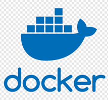
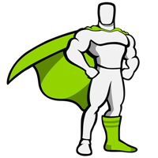

### Hi there, my name is Vitalii

- 🪛 I’m currently working on a couple of my projects: cll-app, cll-server, telemechanics server
- 👀 I’m interested in HTML/CSS/JavaScript/React/Node.js
- 🌱 I'm currently getting a Master of Science in Computer Science at Woolf(Neoversity)
- 🔭 I’m looking for new friends, mentors, a good team and work with interesting tasks
- 🎬 I like Star Trek and other science fiction
- ⚡ Fun fact: **Sweat saves blood. But, in hand-to-hand combat, the one with the most ammo wins**
- 📫 How to reach me: **mohara88@ukr.net**

### My stack and tools

